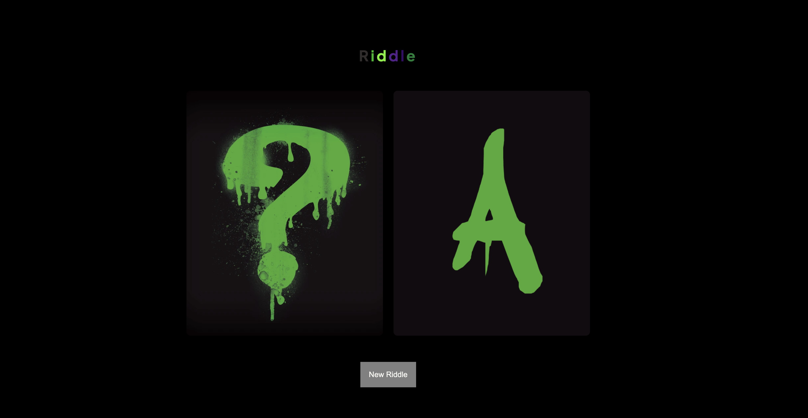

# Riddle Me This

This uses the riddles api (https://riddles-api.vercel.app/), that asks a random riddle and gives the answer to the user

 

## Why?

Wanted to create an user friendly way to access a free api that required no authorization key 

## Running the program with node

Clone this repo

```
git clone https://github.com/BKFOE/Riddle.git
cd Riddle-API
```

Make sure you have Node.JS 

```
npm i 
node index.js
```

Go to http://localhost:3000/